# Screenshots

Captured from the app running for real — `npm run web`, driven in headless Chromium at 402×874 @2x
with seeded local storage. Not mockups.

Regenerate with `node Docs/screenshots/capture.mjs` while `npm run web` is up on port 8090.

## Onboarding

| | |
|---|---|
| 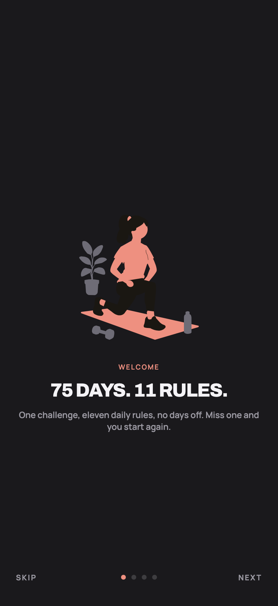 | 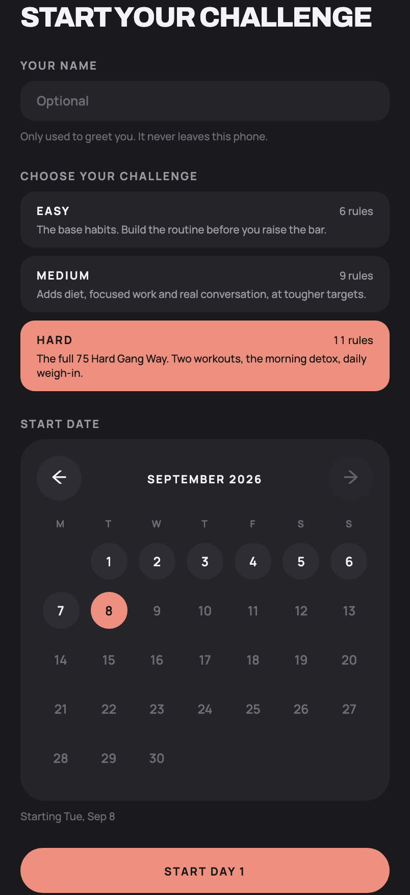 |
| **Welcome** — the intro carousel, four slides. | **Choose your challenge** — Easy, Medium or Hard, an optional name, and the start date on a calendar. |

## Today

| | |
|---|---|
| 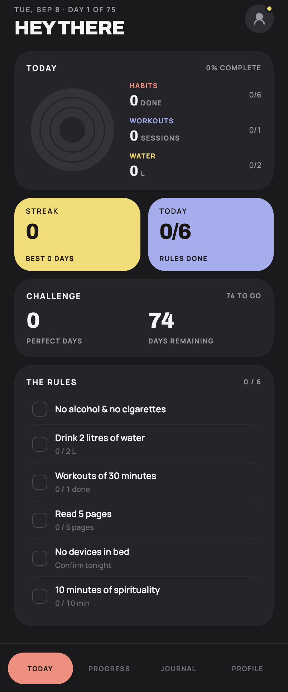 | 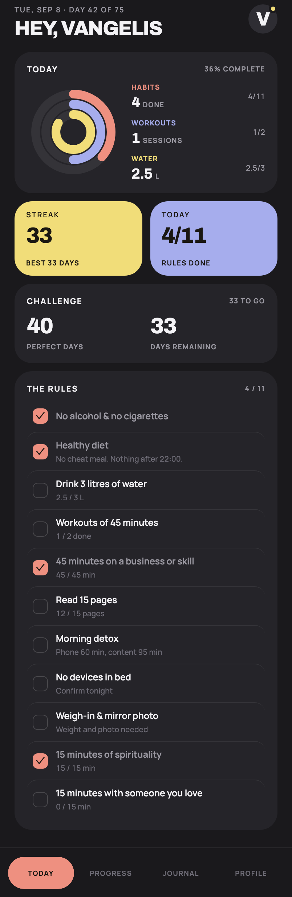 |
| **Day 1 on Easy** — six rules at Easy's own targets, no name given so the greeting reads "Hey there". | **Day 42 on Hard** — 4 of 11, rings for habits, workouts and water. |

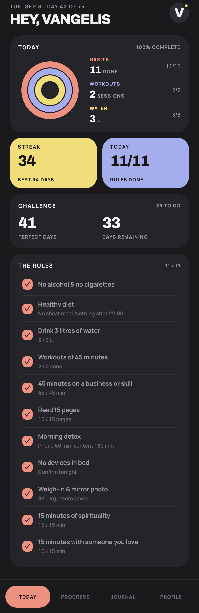

**A perfect day** — 11 of 11, every rule met against the Hard challenge.

## Progress, Journal and Profile

| | |
|---|---|
| 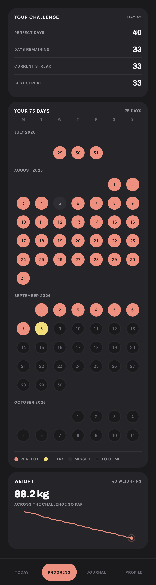 | 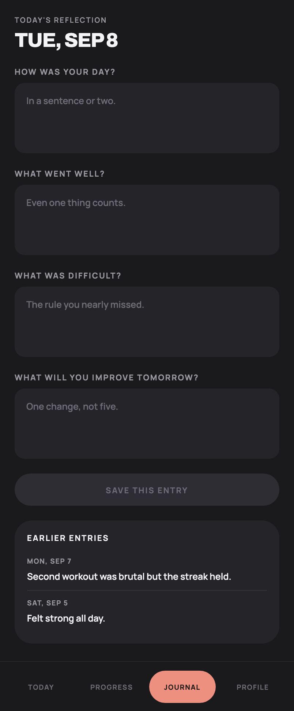 |
| **Progress** — the stats, the seventy-five days as a real calendar, and the weight trend. | **Journal** — one reflection a day, saved without leaving the screen. |
| 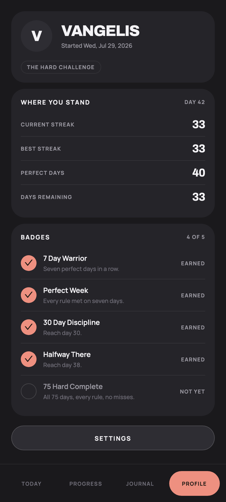 | 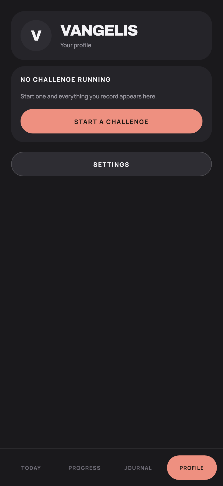 |
| **Profile** — where you stand, and the five badges. | **After a reset** — the profile survives; the challenge does not. |

## Settings

| | |
|---|---|
| 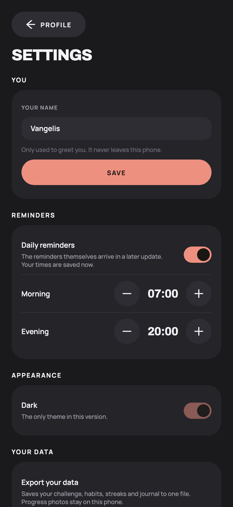 | 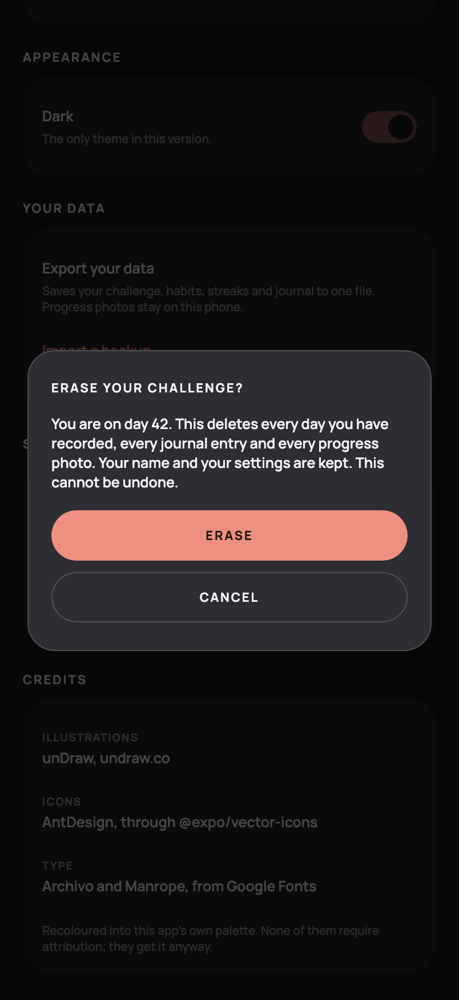 |
| **Settings** — your name, the reminder times, the theme, export and import, the two ways to start over, and the credits. | **Erasing** — the confirmation names exactly what goes and what stays. |

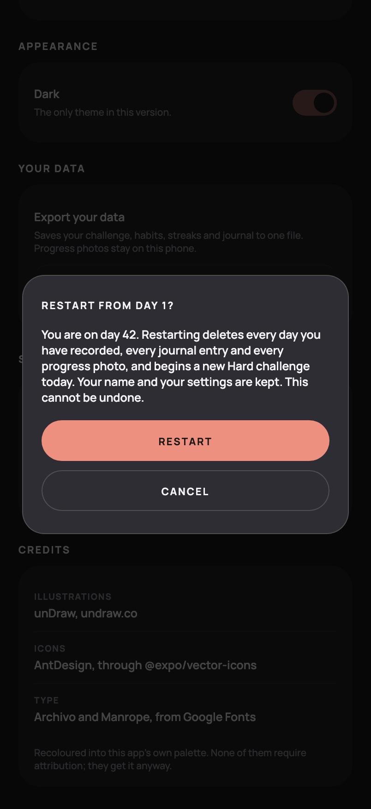

**Restarting** — the same gate, naming the challenge that is about to begin.

## Habit detail

| | |
|---|---|
|  | 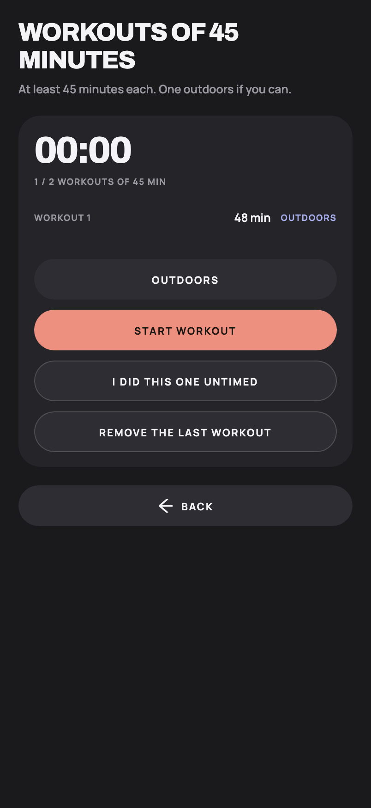 |
| **Water** — 2.5 of 3 litres, with the three increments and an undo. | **Workouts** — one session of 48 minutes recorded, with an outdoor toggle. |
|  | 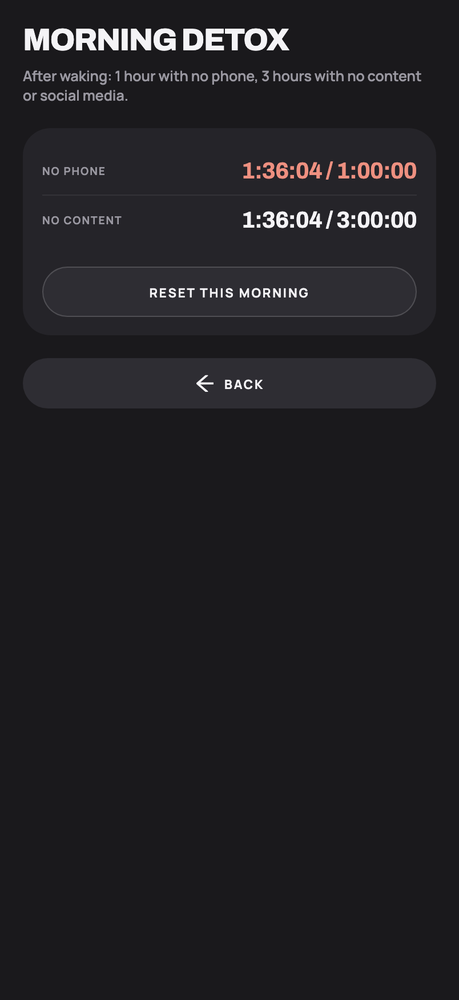 |
| **Skill timer** — 45 minutes reached. Only the start timestamp is stored. | **Morning detox** — both windows counting from one wake-up. |
| 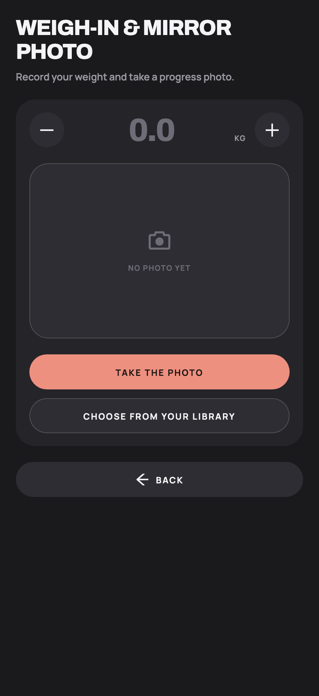 | 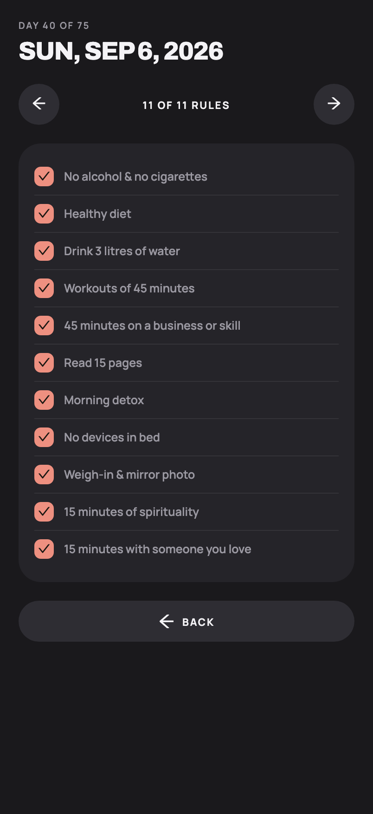 |
| **Weigh-in** — the weight and the mirror photo, both needed for the rule. | **A past day** — read only, with arrows to walk through the week. |

## What the seed data is

- Profile "Vangelis", Hard challenge started 41 days ago
- Forty perfect days and one broken one, so the streak is 33 and the best is 33
- Today partly done: water 2.5/3, one workout of 48 minutes, reading 12/15, the detox 95 minutes in

The Easy screenshot uses a separate seed: a fresh day 1, no name, nothing recorded.

## Console

Zero page errors and zero console errors across all eighteen screens.
