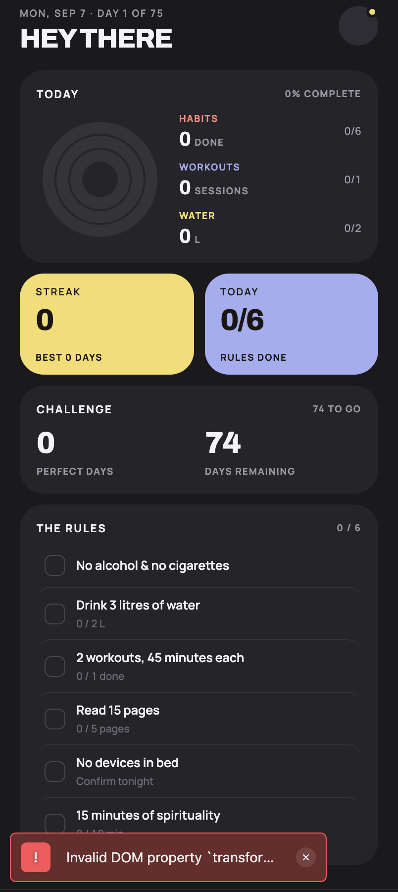
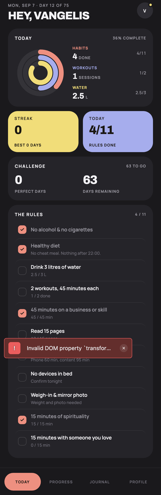
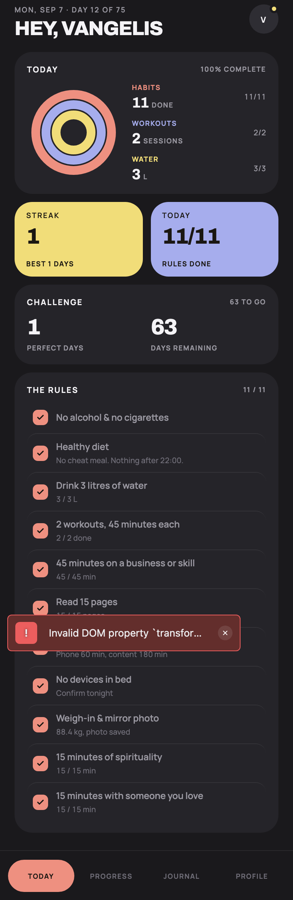
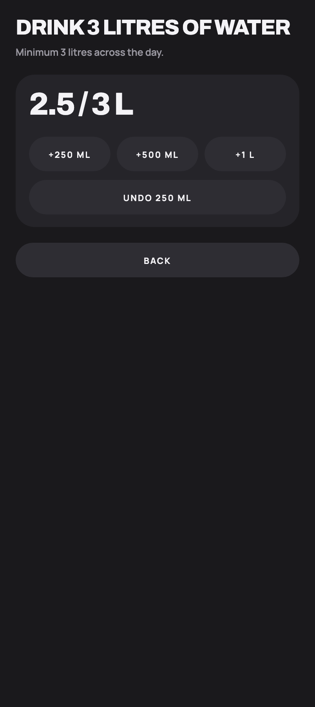
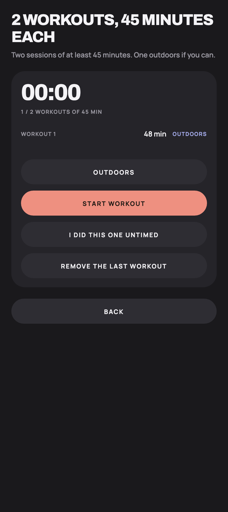
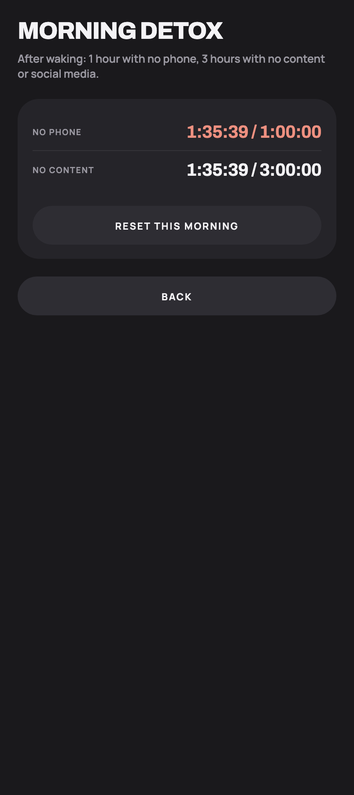

# Screenshots

Captured from the app running for real — `npm run web`, driven in headless Chromium at 402×900 @2x
with seeded local storage. Not mockups.

Regenerate with `Docs/screenshots/capture.mjs` (see the bottom of this file).

## Onboarding

| | |
|---|---|
|  |  |
| **Welcome** — the intro carousel, four slides. | **Choose your challenge** — Easy, Medium or Hard, plus an optional name and a start date. |

## Today

| | |
|---|---|
|  |  |
| **Day 1 on Easy** — six rules, nothing done, no name given so the greeting reads "Hey there". | **Day 12 on Hard** — 4 of 11, rings for habits, workouts and water. |

**A perfect day** — 11 of 11, every rule met against the Hard challenge.

## Habit detail

| | |
|---|---|
|  |  |
| **Water** — 2.5 of 3 litres, with the three increments and an undo. | **Workouts** — two sessions of 45 minutes, one recorded, with an outdoor toggle. |
|  |  |
| **Skill timer** — 45 minutes reached. Only the start timestamp is stored. | **Morning detox** — both windows counting from one wake-up, 95 minutes in. |

## What the seed data is

- Profile "Vangelis", Hard challenge started 11 days ago
- 10 perfect days and one broken day, so the streak is 6 and the best is 6
- Today partly done: water 2.5/3, one workout of 48 minutes, reading 12/15, the detox 95 minutes in

The Easy screenshot uses a separate seed: a fresh day 1, no name, nothing recorded.

## Known rendering note

`react-native-svg` logs `Invalid DOM property 'transform-origin'` on web for the progress rings.
It is a library-level web quirk and does not appear on native; the rings render correctly.
